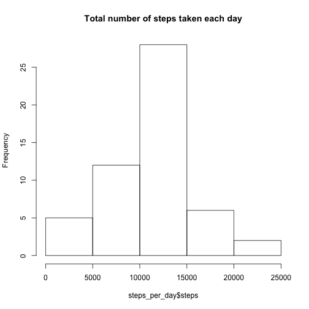
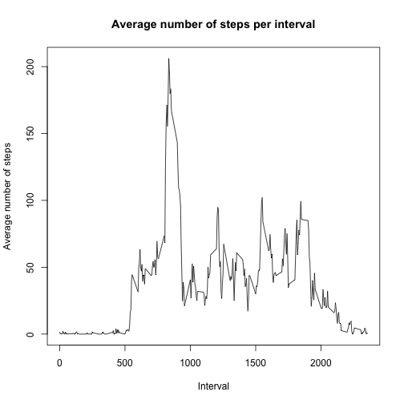

#Introduction
It is now possible to collect a large amount of data about personal movement using activity monitoring devices such as a Fitbit, Nike Fuelband, or Jawbone Up. These type of devices are part of the "quantified self" movement -- a group of enthusiasts who take measurements about themselves regularly to improve their health, to find patterns in their behavior, or because they are tech geeks. But these data remain under-utilized both because the raw data are hard to obtain and there is a lack of statistical methods and software for processing and interpreting the data.

This assignment makes use of data from a personal activity monitoring device. This device collects data at 5 minute intervals through out the day. The data consists of two months of data from an anonymous individual collected during the months of October and November, 2012 and include the number of steps taken in 5 minute intervals each day.

#Data
The data for this assignment can be downloaded from the course web site:

Dataset: Activity monitoring data: https://d396qusza40orc.cloudfront.net/repdata%2Fdata%2Factivity.zip

The variables included in this dataset are:

steps: Number of steps taking in a 5-minute interval (missing values are coded as NA)

date: The date on which the measurement was taken in YYYY-MM-DD format

interval: Identifier for the 5-minute interval in which measurement was taken

The dataset is stored in a comma-separated-value (CSV) file and there are a total of 17,568 observations in this dataset.

#Assignment

##Loading and preprocessing the data


```r
fileUrl <- "https://d396qusza40orc.cloudfront.net/repdata%2Fdata%2Factivity.zip"
download.file(fileUrl, destfile = "activity.zip", mode = "wb", method = "curl")
unzip("activity.zip")
activitydata <- read.csv("activity.csv")
```


##What is mean total number of steps taken per day?

###Make a histogram of the total number of steps taken each day

```r
steps_per_day <- aggregate(steps ~ date, data = activitydata, FUN = sum, na.rm = TRUE)
hist(steps_per_day$steps, main = "Total number of steps taken each day")
```

 


###Calculate and report the mean and median total number of steps taken per day

###Mean:

```r
mean(steps_per_day$steps)
```

```
## [1] 10766.19
```

###Median:

```r
median(steps_per_day$steps)
```

```
## [1] 10765
```

##What is the average daily activity pattern?

###Make a time series plot of the 5-minute interval and the average number of steps taken, averaged across all days


```r
avg_steps_per_interval <- aggregate(steps ~ interval, data = activitydata, FUN = mean, na.rm = TRUE)
plot(x = avg_steps_per_interval$interval, y = avg_steps_per_interval$steps, type='l',  
     main="Average number of steps per interval", xlab="Interval", ylab="Average number of steps")
```

 

###Which 5-minute interval, on average across all the days in the dataset, contains the maximum number of steps?


```r
max_steps <- which.max(avg_steps_per_interval$steps)
interval_with_max_steps <- avg_steps_per_interval[max_steps, ]
interval_with_max_steps
```

```
##     interval    steps
## 104      835 206.1698
```
###Interval 835 contains the maximum average number of steps at 206.2


